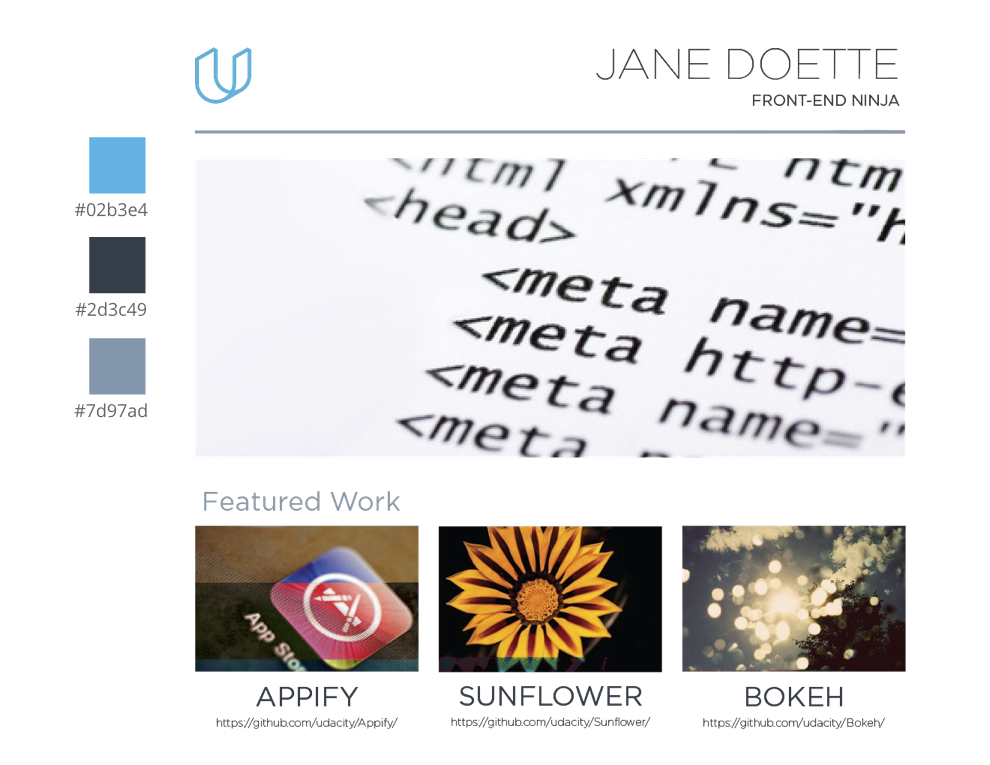

# Project: Build a Portfolio Site

This is my second project of the **Udacity Full Stack Web Developer Nanodegree**. The Goal in this project was to replicate the following design mockup in HTML and CSS:

The site is also fully responsive, meaning that it renders nicely on any device (smartphones, tablets, desktop).

I added some extra functionality:
- a carousel which changes the pictures every 3s in the main frame
- a pop-up window which provides some additional information to my portfolio

I used the [Bootstrap 3 Framework](http://getbootstrap.com) for the grid system of the page as well as for the carousel and for the pop-up window.

## How to run it?
Simply click [here]().

## References

1. [Bootstrap Carousel Tutorial](https://bootstrapbay.com/blog/bootstrap-3-carousel-tutorial/)

2. [Udacity Full Stack Web Developer Nanodegree](https://www.udacity.com/course/full-stack-web-developer-nanodegree--nd004)